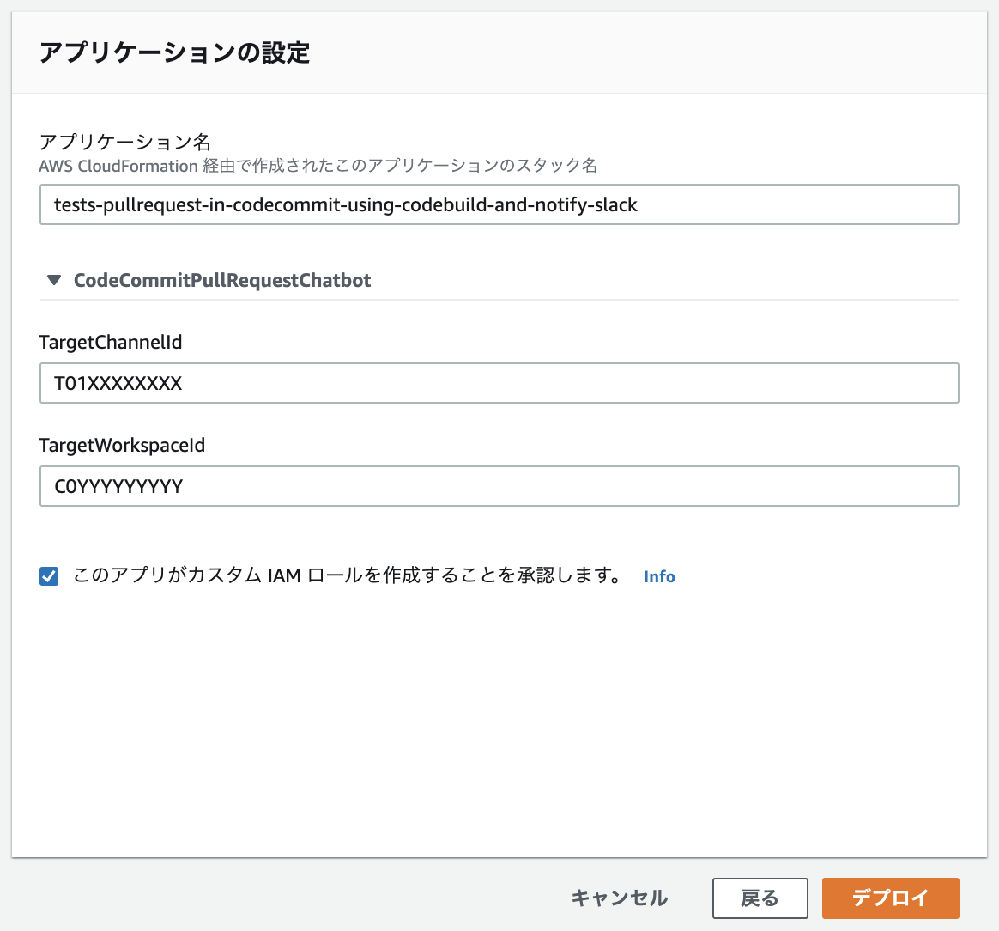

# aws-codecommit-pull-request-aws-codebuild-aws-chatbot
This repository contains sample code that tests pull requests created in AWS CodeCommit with CodeBuild and notifies to Slack using AWS Chatbot.

referenced in the qiita post:
[CodeCommitのプルリクをCodeBuildで検証しAWS ChatbotでSlack通知する](https://qiita.com/joe-king-sh/items/d896ec66a93212e92147)


## Getting Started
### Prerequisites
 - macOS Catalina 10.15.6
 - go version go1.15.2 darwin/amd64
 - aws-cli/2.0.17
 - SAM CLI, version 1.2.0
 - Slack 4.8.0

Before you get started, make sure you've completed the tasks that Create new chatbot client.


### Build
```
$ make
```

### Deployment
```
$ sam deploy --guided --capabilities CAPABILITY_NAMED_IAM
```

You can also deploy using [this Serverless Application Repository](https://ap-northeast-1.console.aws.amazon.com/lambda/home?region=ap-northeast-1#/create/app?applicationId=arn:aws:serverlessrepo:ap-northeast-1:757523705531:applications/tests-pullrequest-in-codecommit-using-codebuild-and-notify-slack).



## Reference
- [Getting started with AWS Chatbot](https://docs.aws.amazon.com/chatbot/latest/adminguide/getting-started.html)

- [Validating AWS CodeCommit Pull Requests with AWS CodeBuild and AWS Lambda](https://aws.amazon.com/jp/blogs/devops/validating-aws-codecommit-pull-requests-with-aws-codebuild-and-aws-lambda/)

## Link
- Qiita
  - [CodeCommitのプルリクをCodeBuildで検証しAWS ChatbotでSlack通知する](https://qiita.com/joe-king-sh/items/d896ec66a93212e92147)

- ServerlessApplicationRepository 
  - [ tests-pullrequest-in-codecommit-using-codebuild-and-notify-slack](https://ap-northeast-1.console.aws.amazon.com/lambda/home?region=ap-northeast-1#/create/app?applicationId=arn:aws:serverlessrepo:ap-northeast-1:757523705531:applications/tests-pullrequest-in-codecommit-using-codebuild-and-notify-slack) 